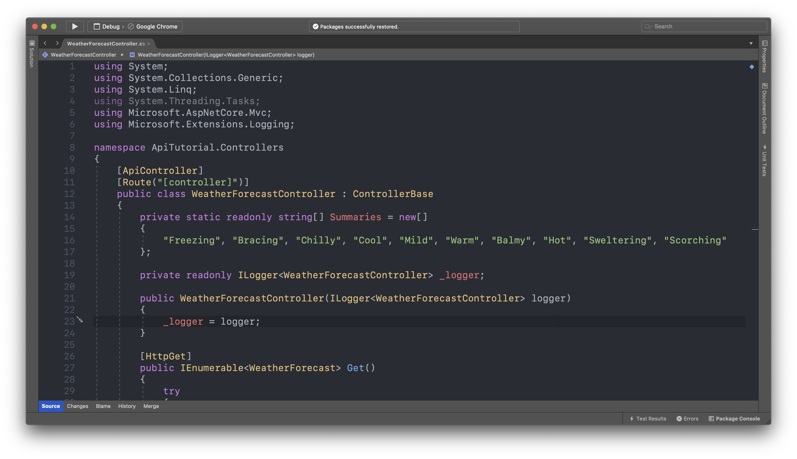
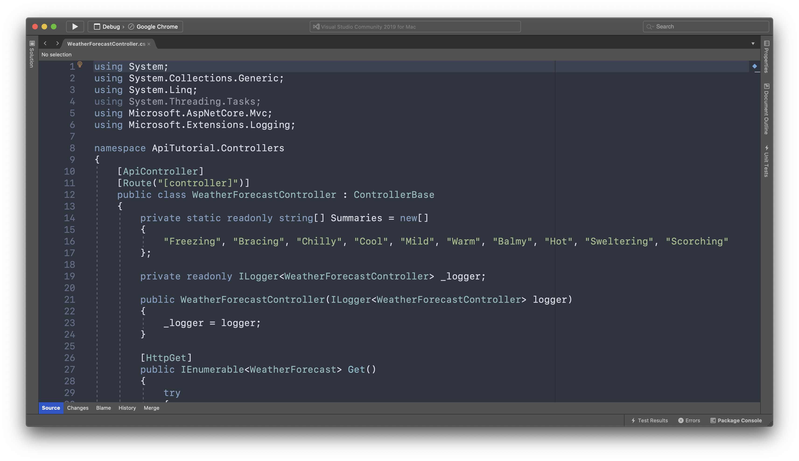
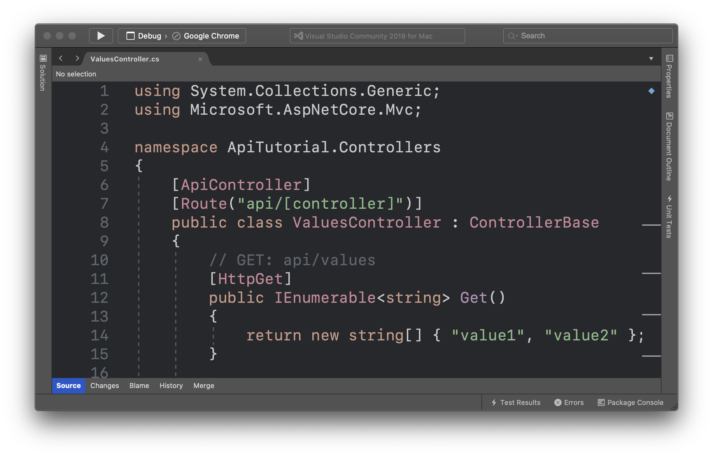

# Visual Studio Mac Color Themes

Elegant Color themes for Visual Studio Mac users. Go to [Repository](https://github.com/rahmanyerli/Visual-Studio-Mac-Color-Themes)

## One Dark Color Theme

## Nord Color Theme

## Ra Color Theme

### How to install a new color theme?

Follow the instructions in the documentation by clicking the link below.

[Microsoft Docs](https://docs.microsoft.com/en-us/visualstudio/mac/editor-themes?view=vsmac-2019)